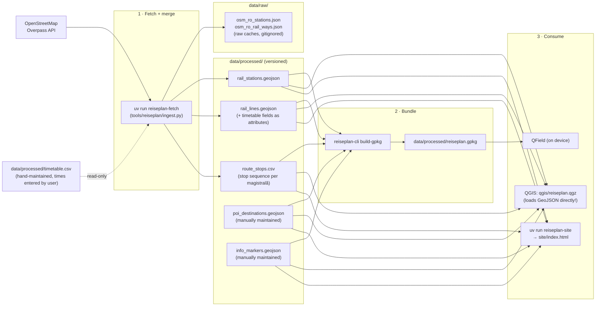
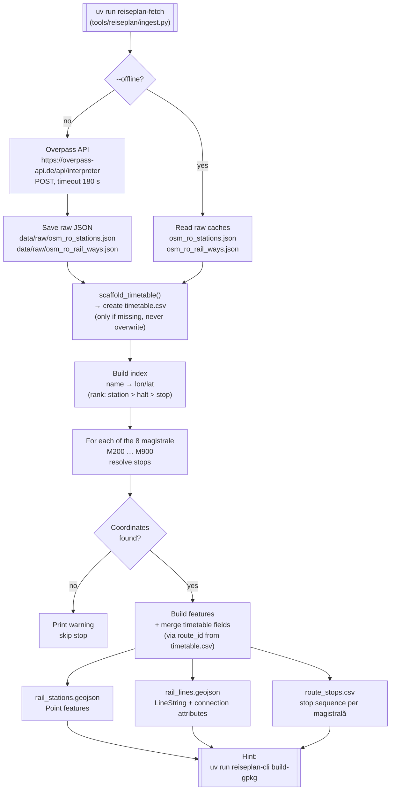
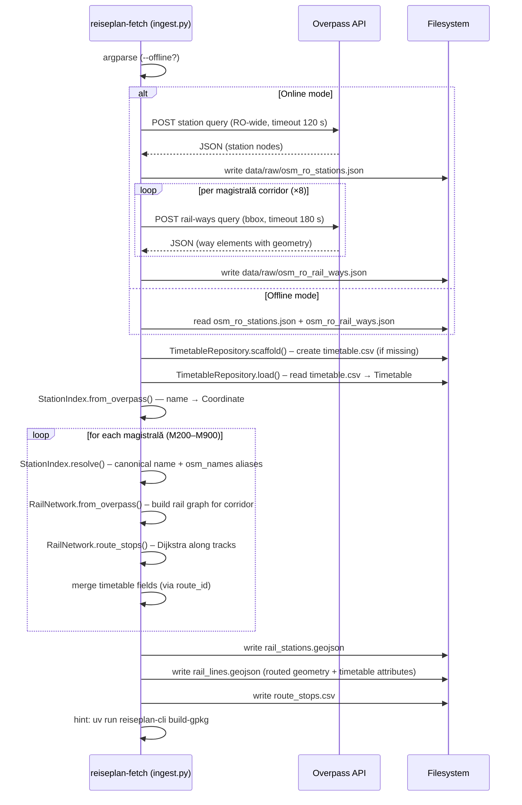
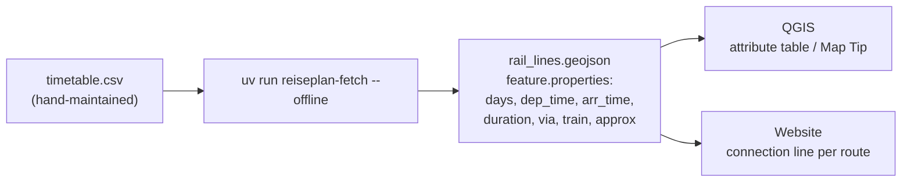
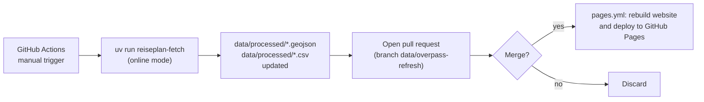

# CFR Rail Data: Fetch Process and Data Flow

Technical reference for `uv run reiseplan-fetch` (`tools/reiseplan/ingest.py`) —
the command that fetches Romanian railway data (CFR magistrale 200–900) from
OpenStreetMap and converts it into project-ready GeoJSON/CSV files.

The query syntax itself is explained in [docs/05_overpass_101.md](05_overpass_101.md).

---

## Context: fetch process in the overall pipeline

`reiseplan-fetch` sits at the **start** of the data pipeline. The files it
produces are the versioned source that all downstream steps build on. Alongside
it, `timetable.csv` is a **hand-maintained** source for real connection data —
the fetch command reads it but never writes it.



> **Note:** `qgis/reiseplan.qgz` loads GeoJSON **directly** via relative paths —
> it does **not** reference the GPKG. The GPKG is exclusively the bundle for
> QField export. If you rename a GeoJSON file, update the path in the `.qgz`
> (the file is a ZIP containing `reiseplan.qgs`).

---

## Fetch flow overview



---

## Data source and licence

| Source | Content | Licence |
|---|---|---|
| OpenStreetMap via Overpass API | Names/coordinates of all named rail stops **and** the `railway=rail` track geometry per corridor | **ODbL 1.0** |
| Wikipedia / CFR line definition | Stop sequence and official line lengths (M200–M900) | — |
| `timetable.csv` | Connection data (hand-maintained from infofer.ro) | — |

> **ODbL requirement:** When distributing derived data (GeoJSON, CSV, GPKG,
> website) the attribution `© OpenStreetMap contributors` must be included.
> Short link: <https://www.openstreetmap.org/copyright>

---

## Overpass query

The command sends **two types** of queries — see [docs/05_overpass_101.md](05_overpass_101.md) for the full syntax walk-through.

**Query 1 — station nodes** (one call, Romania-wide):

```overpassql
[out:json][timeout:120];
area["ISO3166-1"="RO"][admin_level=2]->.ro;
node["railway"~"^(station|halt|stop)$"]["name"](area.ro);
out tags center;
```

Result: all named rail stops in Romania (~700–900 nodes). Fetched once, cached, matched locally.

**Query 2 — rail track geometry** (one call per magistrală corridor):

```overpassql
[out:json][timeout:180];
way["railway"="rail"]["service"!~"."](S,W,N,E);
out geom;
```

One bounding box per line (station coords ± 0.25°). The `["service"!~"."]` filter drops sidings and yards. `out geom` returns the full vertex list, which `RailNetwork` uses to build the routing graph.

Query syntax details: [docs/05_overpass_101.md](05_overpass_101.md).

---

## Line definition (hard-coded)

The CFR magistrale and their stops are defined in `tools/reiseplan/catalog.py` as `Magistrale`/`Stop`
objects. These are the canonical data — they come **not** from OSM but reflect
the official CFR line layout (Wikipedia).

| Magistrală | Route | Stops | km |
|---|---|---|---|
| M200 | Brașov – Sibiu – Arad | 7 | 500 |
| M300 | București – Brașov – Cluj-Napoca – Oradea | 8 | 647 |
| M400 | Brașov – Dej – Satu Mare | 4 | 560 |
| M500 | București – Bacău – Suceava | 7 | 488 |
| M600 | Făurei – Bârlad – Iași | 4 | 395 |
| M700 | București – Brăila – Galați | 5 | 229 |
| M800 | București – Constanța – Mangalia | 5 | 225 |
| M900 | București – Craiova – Timișoara | 5 | 533 |

Each `Stop` carries a canonical name (`name`), the city name (`city`), and
optionally a list of alternative OSM spellings (`osm_names`). This is necessary
because OSM names can diverge from German/Romanian standard names (e.g.
`Cluj Napoca` instead of `Cluj-Napoca`, or `Gara de Nord` instead of
`București Nord`).

---

## Processing steps in detail



### Index building (`StationIndex.from_overpass`)

The Overpass station response is converted to a `name → Coordinate` dictionary
(`tools/reiseplan/overpass.py`). When the same name appears multiple times (OSM
duplicates), the type with the highest rank wins:

| OSM `railway` value | Rank |
|---|---|
| `station` | 0 (highest) |
| `halt` | 1 |
| `stop` | 2 |
| other | 9 |

Coordinate fallback: nodes carry `lat`/`lon` directly; ways/relations only have
`center`. The code uses an explicit `in` check (not `or`) so `lat/lon == 0.0`
is not treated as missing.

### Stop resolution (`StationIndex.resolve`)

For each `Stop`, all `lookup_names()` (canonical name + `osm_names` list) are
checked against the index in order. The first match wins — returns
`Some(Coordinate)`. If no name is found, `Nothing` is returned, a warning is
printed, and the stop is omitted from the geometry (the rest of the magistrală
is still written, provided at least two stops resolved).

### Track routing (`RailNetwork`)

After the stations are resolved, `RailNetwork.from_overpass(ways_data)` builds
an undirected weighted graph from the `railway=rail` way geometry for that
corridor. `route_stops(coords)` then runs Dijkstra between consecutive stops,
concatenates the path segments, and falls back to a straight line for any
segment where the graph has a gap — tagged `geom_source = "fallback-straight"`.
See `tools/reiseplan/routing.py` and [docs/07_architecture.md](07_architecture.md).

### Station deduplication

`București Nord` appears on M300, M500, M700, M800, and M900. Only **one**
`rail_stations` feature is created (ID `ST01`). Assignment of multiple lines
to the same station happens via the `route_id` field in `route_stops.csv`.

---

## Timetable: hand-maintained connection data

### Concept

`data/processed/timetable.csv` is the only file in the project that is
**maintained by hand** and **never** overwritten by a script. It contains one
row per magistrală with the simplest regular connection (e.g. the fastest IC/IR
București–Timișoara on weekdays).

The fetch process reads it and merges the fields as **attributes into
`rail_lines.geojson`** (key: `route_id`). Times then appear automatically in
QGIS (attribute table, Identify, optionally Map Tip) and on the website, as soon
as you rebuild the data once.



### Schema `timetable.csv`

| Column | Content | Pre-filled? |
|---|---|---|
| `route_id` | Magistrală code, e.g. `M900` | ✓ (key) |
| `from_city` | Departure city | ✓ from stop sequence |
| `to_city` | Arrival city | ✓ from stop sequence |
| `days` | e.g. `täglich`, `Mo–Fr`, `Sommer` | — |
| `dep_time` | Departure `HH:MM` | — |
| `arr_time` | Arrival `HH:MM` | — |
| `duration` | Journey duration, e.g. `5:30` | — |
| `via` | Intermediate cities (comma-separated) | ✓ from stop sequence |
| `train` | Train number/name, e.g. `IR 1822` | — |
| `approx` | Which time fields are estimates: subset of `{dep,arr}` | — |
| `notes` | Free text (seasonal note, etc.) | — |

### Workflow: entering and applying times

```bash
# 1. Open timetable.csv in an editor and fill in the times
nvim data/processed/timetable.csv

# 2. Rebuild data (no network needed):
uv run reiseplan-fetch --offline
# → rail_lines.geojson now carries the dep_time, arr_time, … fields

# 3. Update GPKG and website:
uv run reiseplan-cli build-gpkg
uv run reiseplan-site

# 4. Inspect the result:
uv run reiseplan-cli timetable
```

### Sources for timetable times

CFR does not publish an open GTFS feed. Reliable sources:
- **infofer.ro:** <https://mersultrenurilor.infofer.ro> (official CFR journey planner)
- **railplanner / Eurail:** for international IC/EC connections

The entered times are a **snapshot** (not a live feed). Timetable changes
(usually December and June) may make them stale — record the date of last
verification in the `notes` field, e.g. `Stand: Mai 2026`.

---

## Output files

All files are in `EPSG:4326` (WGS 84) and follow the schema of the other project
data.

### `data/processed/rail_stations.geojson`

GeoJSON `FeatureCollection`, geometry type `Point`.

| Field | Type | Description |
|---|---|---|
| `station_id` | String | Short ID, e.g. `ST01` |
| `name` | String | Canonical station name |
| `city` | String | Associated city |

### `data/processed/rail_lines.geojson`

GeoJSON `FeatureCollection`, geometry type `LineString`. The vertices follow the
**real OSM track alignment**: the stop sequence is routed along the
`railway=rail` graph (`RailNetwork`, shortest path between consecutive stops), so
the line curves through the valleys instead of cutting straight between stations.
Where the rail graph has a gap, that one leg falls back to a straight line and the
feature is tagged `geom_source = "fallback-straight"` (see below).

| Field | Type | Description |
|---|---|---|
| `route_id` | String | Magistrală code, e.g. `M300` |
| `route_name` | String | Display name, e.g. `M300 · București – … – Oradea` |
| `from_city` | String | Departure city |
| `to_city` | String | Arrival city |
| `tags` | String | Comma-separated topic tags |
| `line_ref` | String | Same as `route_id` |
| `length_km` | Integer | Official line length (Wikipedia) |
| `geom_source` | String | `osm-routed` (track-following) or `fallback-straight` (a leg hit a graph gap) |
| `days` | String | e.g. `täglich` (from `timetable.csv`, empty until entered) |
| `dep_time` | String | Departure time `HH:MM` |
| `arr_time` | String | Arrival time `HH:MM` |
| `duration` | String | Journey duration, e.g. `5:30` |
| `via` | String | Intermediate cities (pre-filled from stop sequence) |
| `train` | String | Train number/name |
| `approx` | String | Which times are estimates: subset of `{dep,arr}` |

### `data/processed/route_stops.csv`

Stop sequences per magistrală, one row per stop. No time columns — for times see
`timetable.csv`.

| Column | Description |
|---|---|
| `route_id` | Magistrală code |
| `sequence` | Order (1 = first stop) |
| `station` | Canonical station name |
| `city` | Associated city |
| `trip_hint` | Qualitative role: `Start (...)`, `Ziel (...)`, `Halt / Umstieg (...)` |

### `data/raw/osm_ro_stations.json`

Raw cache of the Overpass response. Not versioned (`.gitignore`), overwritten on
each online run. Enables `--offline` operation without a new network request.

### `data/raw/osm_ro_rail_ways.json`

Raw cache of the per-corridor `railway=rail` geometry queries, keyed by magistrală
ref (`{"M200": {…overpass…}, …}`). One Overpass request per corridor (the bounding
box of that line's stations, buffered ~0.25°), with a short pause between them.
Not versioned (`.gitignore`), overwritten on each online run; `--offline` rebuilds
the routed geometry from it without the network.

---

## Usage

```bash
# Query Overpass, cache, and build all output files:
uv run reiseplan-fetch

# Rebuild from existing raw caches only (no network),
# e.g. after entering times in timetable.csv:
uv run reiseplan-fetch --offline
```

Then update the GPKG bundle for QGIS/QField:

```bash
uv run reiseplan-cli build-gpkg
```

### Dependencies

`reiseplan-fetch` uses only the **Python standard library** plus **rich** (already
in `pyproject.toml`) — no additional packages needed beyond the project's own
dependencies.

---

## CI: automatic data refresh

Workflow: `.github/workflows/refresh-data.yml`



The refresh runs **only on manual trigger** (Actions → "Bahndaten aktualisieren
(Overpass)" → *Run workflow*). A weekly `cron` is commented out in the workflow
and can be enabled if needed.

> **Note:** The CI refresh fetches new OSM geometry but does not touch
> `timetable.csv` — entered times are preserved when the PR is merged, as long as
> `timetable.csv` was not manually modified.

After the PR is merged, `pages.yml` rebuilds the online map automatically.
Details: [docs/04_web_pages.md](04_web_pages.md).

---

## Further reading

- Overpass query syntax explained: [docs/05_overpass_101.md](05_overpass_101.md)
- Online map and GitHub Pages: [docs/04_web_pages.md](04_web_pages.md)
- Overpass Turbo (interactive): <https://overpass-turbo.eu>
- ODbL licence text: <https://opendatacommons.org/licenses/odbl/>
