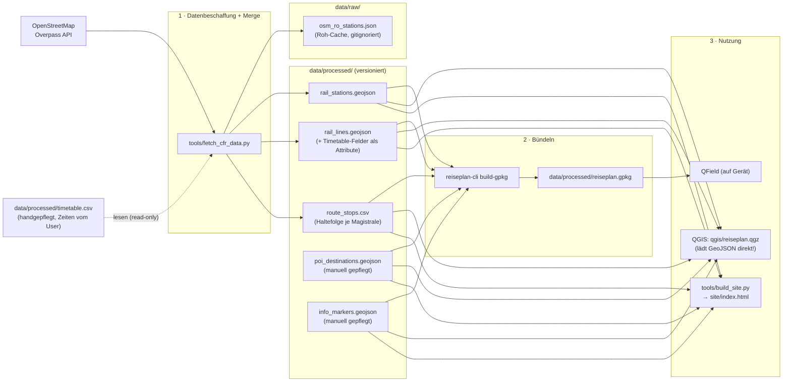
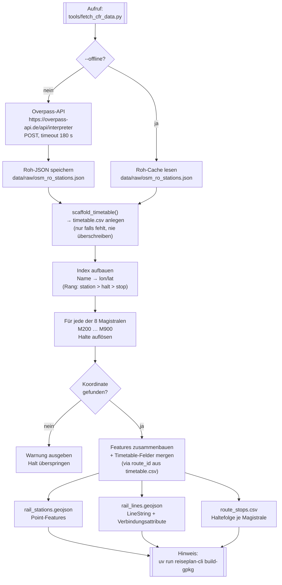
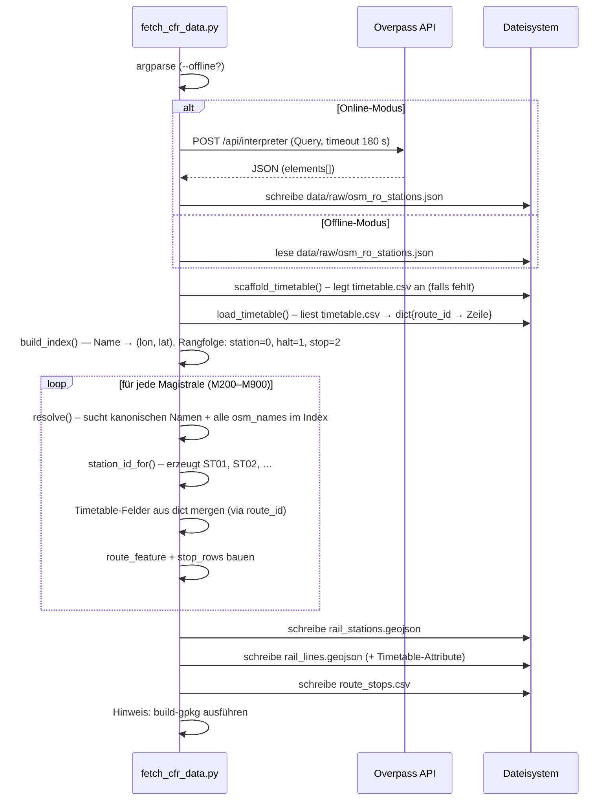
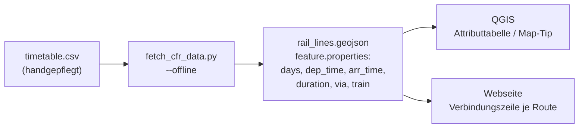
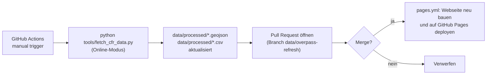

# CFR-Bahndaten: Fetch-Prozess und Datenfluss

Technische Referenz für `tools/fetch_cfr_data.py` — das Skript, das die
rumänischen Eisenbahndaten (CFR-Magistralen 200–900) aus OpenStreetMap
beschafft und in projektfähige GeoJSON/CSV-Dateien umwandelt.

Die Query-Syntax selbst erklärt [docs/05_overpass_101.md](05_overpass_101.md).

---

## Einordnung: Fetch-Prozess in der Gesamtpipeline

`fetch_cfr_data.py` steht am **Anfang** der Datenpipeline. Die von ihm
erzeugten Dateien sind die versionierte Quelle, auf der alle nachgelagerten
Schritte aufbauen. Daneben existiert `timetable.csv` als **handgepflegte**
Quelle für echte Verbindungsdaten — das Fetch-Skript liest sie, schreibt sie
aber nie.



> **Achtung:** `qgis/reiseplan.qgz` lädt die GeoJSON **direkt** über relative
> Pfade — es referenziert **nicht** die GPKG. Die GPKG ist ausschließlich das
> Bündel für den QField-Export. Wer eine GeoJSON umbenennt, muss den Pfad in der
> `.qgz` mitziehen (die Datei ist ein ZIP mit `reiseplan.qgs`).

---

## Übersicht: Fetch-Ablauf



---

## Datenquelle und Lizenz

| Quelle | Inhalt | Lizenz |
|---|---|---|
| OpenStreetMap via Overpass API | Geometrie und Namen aller benannten Bahn-Haltepunkte in Rumänien | **ODbL 1.0** |
| Wikipedia / CFR-Streckendefinition | Linienführung und offizielle Streckenlängen (M200–M900) | — |
| `timetable.csv` | Verbindungsdaten (handgepflegt nach infofer.ro) | — |

> **ODbL-Pflicht:** Bei Weitergabe der abgeleiteten Daten (GeoJSON, CSV, GPKG,
> Webseite) muss die Namensnennung `© OpenStreetMap-Mitwirkende` beigelegt
> werden. Kurzlink: <https://www.openstreetmap.org/copyright>

---

## Überpass-Query

Das Skript sendet genau eine Query an die Overpass-API:

```overpassql
[out:json][timeout:120];
area["ISO3166-1"="RO"][admin_level=2]->.ro;
node["railway"~"^(station|halt|stop)$"]["name"](area.ro);
out tags center;
```

Das Ergebnis sind **alle benannten Bahn-Haltepunkte Rumäniens** — rund 700–900
Nodes. Das Skript beschränkt sich bewusst auf diesen breiten Rohabruf und
filtert lokal auf die definierten Magistralen-Halte. So reicht ein einziger
Netzaufruf, danach kann `--offline` verwendet werden.

Details zur Query-Syntax: [docs/05_overpass_101.md](05_overpass_101.md).

---

## Liniendefinition (hartcodiert)

Die CFR-Magistralen und ihre Halte sind im Skript als `Line`/`Stop`-Objekte
definiert. Das sind die kanonischen Daten — sie kommen **nicht** aus OSM,
sondern spiegeln die offizielle CFR-Streckeneinteilung (Wikipedia).

| Magistrale | Strecke | Halte | km |
|---|---|---|---|
| M200 | Brașov – Sibiu – Arad | 7 | 500 |
| M300 | București – Brașov – Cluj-Napoca – Oradea | 8 | 647 |
| M400 | Brașov – Dej – Satu Mare | 4 | 560 |
| M500 | București – Bacău – Suceava | 7 | 488 |
| M600 | Făurei – Bârlad – Iași | 4 | 395 |
| M700 | București – Brăila – Galați | 5 | 229 |
| M800 | București – Constanța – Mangalia | 5 | 225 |
| M900 | București – Craiova – Timișoara | 5 | 533 |

Jeder `Stop` enthält einen kanonischen Namen (`name`), den Stadtnamen (`city`)
und optional eine Liste alternativer OSM-Schreibweisen (`osm_names`). Das ist
nötig, weil OSM-Namen von den deutschen/rumänischen Standardnamen abweichen
können (z. B. `Cluj Napoca` statt `Cluj-Napoca` oder `Gara de Nord` statt
`București Nord`).

---

## Verarbeitungsschritte im Detail



### Index-Aufbau (`build_index`)

Die Overpass-Antwort wird in ein Wörterbuch `name → (lon, lat)` umgewandelt.
Bei mehreren Treffern desselben Namens (Duplikate in OSM) gewinnt der Typ mit
dem höheren Rang:

| OSM-`railway`-Wert | Rang |
|---|---|
| `station` | 0 (höchster) |
| `halt` | 1 |
| `stop` | 2 |
| sonstiges | 9 |

### Halte-Auflösung (`resolve`)

Für jeden `Stop` werden nacheinander alle `lookup_names()` (kanonischer Name
+ `osm_names`-Liste) gegen den Index geprüft. Der erste Treffer gewinnt. Wird
kein Name gefunden, erscheint eine Warnzeile und der Halt fehlt in der
Ausgabegeometrie (der Rest der Magistrale wird trotzdem geschrieben, sofern
mindestens zwei Halte aufgelöst wurden).

### Bahnhof-Deduplizierung

`București Nord` erscheint auf M300, M500, M700, M800 und M900. Es wird
dennoch **nur ein** `rail_stations`-Feature erzeugt (ID `ST01`). Die Zuordnung
mehrerer Linien geschieht über das `route_id`-Feld in `route_stops.csv`.

---

## Timetable: handgepflegte Verbindungsdaten

### Konzept

`data/processed/timetable.csv` ist die einzige Datei im Projekt, die **von Hand
gepflegt** wird und **nie** von einem Skript überschrieben wird. Sie enthält
je eine Zeile pro Magistrale mit der einfachsten regelmäßigen Verbindung
(z. B. den schnellsten IC/IR Bukarest–Timișoara werktags).

Der Fetch-Prozess liest sie und merged die Felder als **Attribute in
`rail_lines.geojson`** (Schlüssel `route_id`). Damit tauchen die Zeiten
automatisch in QGIS (Attributtabelle, Identify, optional Map-Tip) und auf der
Webseite auf, sobald man die Daten einmal neu baut.



### Schema `timetable.csv`

| Spalte | Inhalt | Vorbefüllt? |
|---|---|---|
| `route_id` | Magistralen-Kürzel, z. B. `M900` | ✓ (Schlüssel) |
| `from_city` | Startstadt der Verbindung | ✓ aus Haltefolge |
| `to_city` | Zielstadt der Verbindung | ✓ aus Haltefolge |
| `days` | z. B. `täglich`, `Mo–Fr`, `Sommer` | — |
| `dep_time` | Abfahrt `HH:MM` | — |
| `arr_time` | Ankunft `HH:MM` | — |
| `duration` | Fahrtdauer, z. B. `5:30` | — |
| `via` | Zwischenstädte (kommasepariert) | ✓ aus Haltefolge |
| `train` | Zugnummer/-name, z. B. `IR 1822` | — |
| `notes` | Freitext (Saisonvermerk o. ä.) | — |

### Workflow: Zeiten eintragen und einpflegen

```bash
# 1. timetable.csv im Editor öffnen und Zeiten eintragen
nvim data/processed/timetable.csv

# 2. Daten neu bauen (kein Netz nötig):
uv run python tools/fetch_cfr_data.py --offline
# → rail_lines.geojson trägt jetzt die Felder dep_time, arr_time, …

# 3. GPKG und Webseite aktualisieren:
uv run reiseplan-cli build-gpkg
uv run python tools/build_site.py

# 4. Ergebnis prüfen:
uv run reiseplan-cli timetable
```

### Quellen für Fahrplanzeiten

CFR veröffentlicht keinen offenen GTFS-Feed. Zuverlässige Quellen:
- **infofer.ro:** <https://mersultrenurilor.infofer.ro> (offizielle CFR-Auskunft)
- **railplanner / Eurail:** für internationale IC/EC-Verbindungen

Die eingetragenen Zeiten sind ein **Snapshot** (kein Live-Feed). Fahrplanwechsel
(meist Dezember und Juni) können sie veralten lassen — Datum der letzten Prüfung
im Feld `notes` eintragen, z. B. `Stand: Mai 2026`.

---

## Ausgabedateien

Alle Dateien liegen in `EPSG:4326` (WGS 84) und folgen dem Schema der anderen
Projektdaten.

### `data/processed/rail_stations.geojson`

GeoJSON `FeatureCollection`, Geometrietyp `Point`.

| Feld | Typ | Beschreibung |
|---|---|---|
| `station_id` | String | Kurzbezeichnung, z. B. `ST01` |
| `name` | String | Kanonischer Bahnhofsname |
| `city` | String | Zugehörige Stadt |

### `data/processed/rail_lines.geojson`

GeoJSON `FeatureCollection`, Geometrietyp `LineString`
(Stützpunkte = aufgelöste Halte in Reihenfolge).

| Feld | Typ | Beschreibung |
|---|---|---|
| `route_id` | String | Magistralen-Kürzel, z. B. `M300` |
| `route_name` | String | Anzeigename (DE), z. B. `M300 · București – … – Oradea` |
| `from_city` | String | Startstadt |
| `to_city` | String | Zielstadt |
| `tags` | String | Kommaseparierte Themen-Tags |
| `line_ref` | String | Identisch mit `route_id` |
| `length_km` | Integer | Offizielle Streckenlänge (Wikipedia) |
| `days` | String | z. B. `täglich` (aus `timetable.csv`, leer bis eingetragen) |
| `dep_time` | String | Abfahrtszeit `HH:MM` |
| `arr_time` | String | Ankunftszeit `HH:MM` |
| `duration` | String | Fahrtdauer, z. B. `5:30` |
| `via` | String | Zwischenstädte (vorbefüllt aus Haltefolge) |
| `train` | String | Zugnummer/-name |

### `data/processed/route_stops.csv`

Haltefolgen je Magistrale, eine Zeile pro Halt. Keine Zeitspalten — für Zeiten
siehe `timetable.csv`.

| Spalte | Beschreibung |
|---|---|
| `route_id` | Magistralen-Kürzel |
| `sequence` | Reihenfolge (1 = erster Halt) |
| `station` | Kanonischer Bahnhofsname |
| `city` | Zugehörige Stadt |
| `trip_hint` | Qualitative Rollenbeschreibung: `Start (...)`, `Ziel (...)`, `Halt / Umstieg (...)` |

### `data/raw/osm_ro_stations.json`

Roh-Cache der Overpass-Antwort. Nicht versioniert (`.gitignore`), wird bei
jedem Online-Lauf überschrieben. Ermöglicht `--offline`-Betrieb ohne erneuten
Netzaufruf.

---

## Aufruf

```bash
# Overpass abfragen, cachen und alle Ausgabedateien bauen:
uv run python tools/fetch_cfr_data.py

# Nur aus vorhandenem Roh-Cache neu bauen (kein Netz),
# z. B. nach dem Eintragen von Zeiten in timetable.csv:
uv run python tools/fetch_cfr_data.py --offline
```

Anschließend das GPKG-Bündel für QGIS/QField aktualisieren:

```bash
uv run reiseplan-cli build-gpkg
```

### Abhängigkeiten

Das Skript verwendet ausschließlich die **Python-Standardbibliothek**
(`urllib`, `json`, `csv`, `pathlib`, `dataclasses`, `argparse`) — keine
zusätzlichen Pakete nötig, kein `uv`/`pip install` erforderlich. Der `uv run`-
Prefix ist optional; `python tools/fetch_cfr_data.py` funktioniert ebenso.

---

## CI: automatischer Daten-Refresh

Workflow: `.github/workflows/refresh-data.yml`



Der Refresh läuft **nur auf manuellen Anstoß** (Actions → „Bahndaten
aktualisieren (Overpass)" → *Run workflow*). Ein wöchentlicher `cron` ist im
Workflow auskommentiert und kann bei Bedarf aktiviert werden.

> **Hinweis:** Der CI-Refresh holt neue OSM-Geometrie, berührt aber
> `timetable.csv` nicht — eingetragene Zeiten bleiben beim Merge des PRs
> erhalten, solange `timetable.csv` nicht manuell geändert wurde.

Nach dem Merge des PRs baut `pages.yml` die Online-Karte automatisch neu.
Details: [docs/04_web_pages.md](04_web_pages.md).

---

## Weiterführende Links

- Overpass-Query-Syntax erläutert: [docs/05_overpass_101.md](05_overpass_101.md)
- Online-Karte und GitHub Pages: [docs/04_web_pages.md](04_web_pages.md)
- Overpass-Turbo (interaktiv): <https://overpass-turbo.eu>
- ODbL-Lizenztext: <https://opendatacommons.org/licenses/odbl/>
